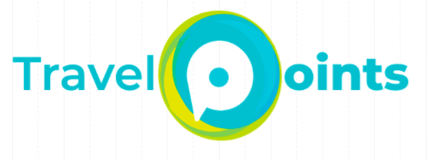

# Travel Points

## Índice

1. Objetivos principales
2. El cliente
3. El usuario
4. Objetivos de negocio
5. Enunciado del problema
6. Research
7. Análisis de resultados
8. Propuesta de solución
9. Prototipo Landing Page
10. Insights Prototipo

## 1. Objetivos principales
- Entender y optimizar el journey de tomar un camión de CDMX a Cuernavaca en autobuses Pullman.
- Conocer todo el proceso de diseños de una solución.

## 2. El cliente
¿Quién es?
 - Cualquier línea de autobuses.
 - Para este proyecto elegimos a Pullman de Morelos como cliente supuesto.

## 3. El usuario
**Características:**

**Objetivos del usuario**

**Journey del usuario**

## 4. Objetivo de negocio

## 5. Enunciado del problema
*“Falta de un sistema de recompensas que beneficie al viajero frecuente y fidelice el uso del servicio de viajes de “una empresa”*

## 6. Research

**Cuestionario**

Esta encuesta está dirigida para personas que han viajado de la Ciudad de México a Cuernavaca al menos una vez en su vida. Tu opinión es importante para poder mejorar los servicios de transporte que existen en la actualidad.

Datos generales:

Edad:
- 18 a 24 años
- 25 a 34 años
- 35 a 45 años

¿Has viajado de la CdMx a Cuernavaca?
 - Si
 - No

¿Con qué frecuencia viajas de CdMx a Cuernavaca?
- Diario
- De 3 a 5 veces por semana
- Fines de semana

Motivos por los que viajas:
- Vivo en Cuernavaca-CdMx
- Visita familiar
- Fin de semana (vacaciones)

¿Qué transporte utilizas para viajar?
- Pullman de Morelos
- ADO
- Blablacar
- Otro:

¿Cuál es la razón por la que no eliges Pullman de Morelos como primera opción para viajar?
- Costo
- Servicio
- Comodidad

¿Cuál es la razón por la que prefieres Pullman de Morelos como primera opción para viajar?
- Por el costo
- Por comodidad
- Por frecuencia de salidas
- Por seguridad

¿A través de qué medio haces la compra de tu boleto?
- Taquilla
- Página web
- Aplicación web

¿Te gustaría contar con un sistema de recompensa por ser cliente frecuente?
- Si
- No

¿Qué beneficios te gustaría tener con este sistema de recompensas?
- Descuentos en viajes
- Viajes gratis
- Descuentos en establecimientos y/o productos
- Promociones de viaje (2x1, paquetes de viaje)

Si Pullman de Morelos te ofreciera este sistema de recompensas por ser viajero frecuente, lo considerarías como tu primera opción de viaje?
- Si
- No

## 7. Análisis de resultados
**Insights Relevantes**

## 8. Propuesta de solución
*"Plataforma de recompensa por puntos para usuario que viaja frecuentemente de la CDMX a Cuernavaca, personalizable a cada línea de autobuses que nos contrate."*

**Beneficios clave**
- Puntaje canjeable para descuentos o viajes gratis
- Historial y personalización de su experiencia en la multiplataforma

## 9. Prototipo Landing Page

## 10. Insights Prototipo

